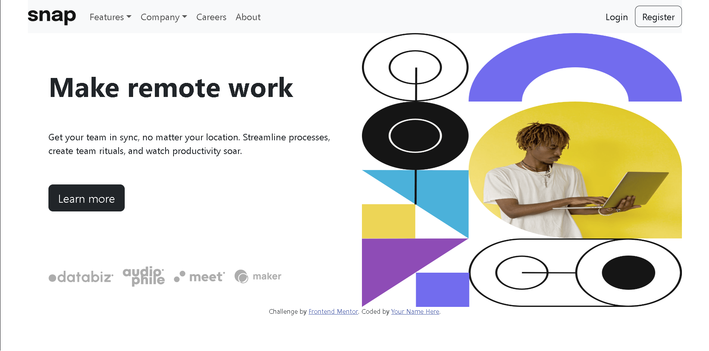

# Frontend Mentor - Intro section with dropdown navigation solution

This is a solution to the [Intro section with dropdown navigation challenge on Frontend Mentor](https://www.frontendmentor.io/challenges/intro-section-with-dropdown-navigation-ryaPetHE5). Frontend Mentor challenges help you improve your coding skills by building realistic projects.

## Table of contents

- [Overview](#overview)
  - [The challenge](#the-challenge)
  - [Screenshot](#screenshot)
  - [Links](#links)
- [My process](#my-process)
  - [Built with](#built-with)
  - [Useful resources](#useful-resources)
- [Author](#author)
- [Acknowledgments](#acknowledgments)

**Note: Delete this note and update the table of contents based on what sections you keep.**

## Overview

### The challenge

Users should be able to:

- View the relevant dropdown menus on desktop and mobile when interacting with the navigation links
- View the optimal layout for the content depending on their device's screen size
- See hover states for all interactive elements on the page

### Screenshot

### Links

- Solution URL: [Add solution URL here](https://www.frontendmentor.io/challenges/intro-section-with-dropdown-navigation-ryaPetHE5/solutions/new)
- Live Site URL: (https://snapentrepreneurs.netlify.app/)

## My process

### Built with

- Semantic HTML5 markup
- CSS custom properties
- Flexbox
- CSS Media queries
- Mobile-first workflow
- [Bootstrap](https://getbootstrap.com)
- [Styled Components](https://fonts.google.com/) - For styles

### Useful resources

- [Stackoverflow](https://www.stackoverflow.com) - This is a very good place to ask for help. Check it out anytime you are having a hard time.

## Author

- Website - [Add your name here](https://www.your-site.com)
- Frontend Mentor - [@lordsonfafa](https://www.frontendmentor.io/profile/lordsonfafa)
- Instagram - [@l.f_borngreat](https://www.instagram.com/lf_borngreat)
